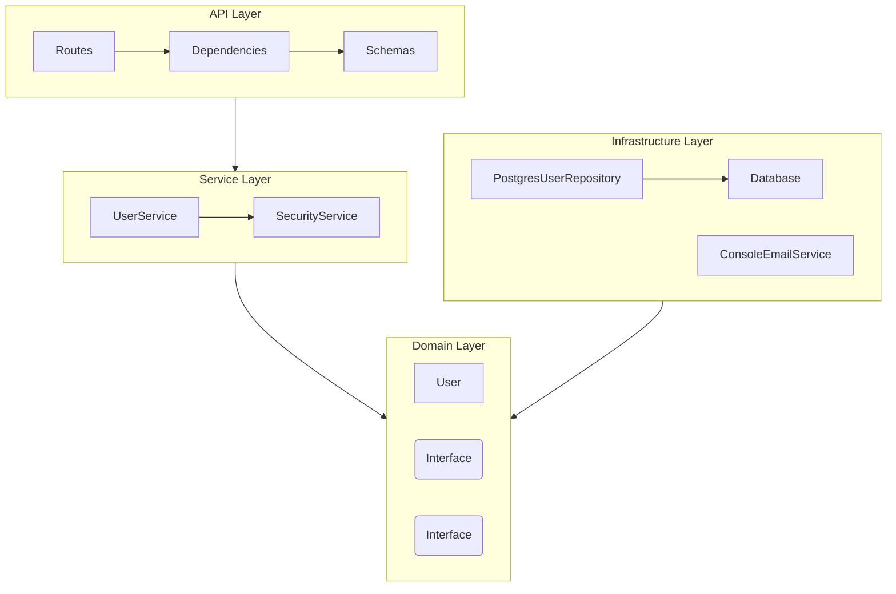

# User Registration API

## Overview
This project implements a User Registration API using FastAPI, following Clean Architecture principles (Hexagonal Architecture).

## Features
- **User Registration**: Create account with email and password
- **Email Verification**: 4-digit activation code sent via email
- **Account Activation**: Verify account with activation code (expires in 1 minute)
- **Code Regeneration**: Request a new activation code if expired

## Architecture
The project follows a Hexagonal / Clean Architecture:



### Layers
1. **Domain**: Contains the core business logic (Entities) and interfaces (Ports). It has no external dependencies.
2. **Service**: Implements the use cases (Register, Activate, Regenerate). Orchestrates the domain objects and ports.
3. **Infrastructure**: Implements the interfaces defined in the domain (Adapters). Handles Database and Email.
4. **API**: The entry point. Handles HTTP requests, validation, and dependency injection.

## Technologies
- **Python 3.10+**
- **FastAPI**: Web framework
- **Asyncpg**: Async PostgreSQL driver (No ORM)
- **Pydantic v2**: Data validation
- **Argon2**: Password hashing
- **Docker**: Containerization

## Quick Start

### Prerequisites
- Docker & Docker Compose

### Run the Application
```bash
# Start the application
make run

# Or without Makefile
docker-compose up --build
```

The API will be available at:
- **API**: http://localhost:8000/api/v1
- **Swagger UI**: http://localhost:8000/docs
- **ReDoc**: http://localhost:8000/redoc

### Stop the Application
```bash
make stop
```

## API Endpoints

| Method | Endpoint | Description | Auth |
|--------|----------|-------------|------|
| `POST` | `/api/v1/users` | Register a new user | None |
| `POST` | `/api/v1/users/activate` | Activate account with code | Basic Auth |
| `POST` | `/api/v1/users/regenerate-code` | Get a new activation code | Basic Auth |
| `GET` | `/health` | Health check | None |

### Example Usage

#### 1. Register a User
```bash
curl -X POST http://localhost:8000/api/v1/users \
  -H "Content-Type: application/json" \
  -d '{"email": "user@example.com", "password": "securepass123"}'
```

#### 2. Get Activation Code
Check the Docker logs to find the activation code:
```bash
make logs
# Look for: "Your activation code is: XXXX"
```

#### 3. Activate Account
```bash
curl -X POST http://localhost:8000/api/v1/users/activate \
  -H "Content-Type: application/json" \
  -u "user@example.com:securepass123" \
  -d '{"code": "1234"}'
```

## Development

### CI/CD & Code Quality
This project uses GitHub Actions for Continuous Integration and Deployment. The pipeline includes:
- **Linting**: Ruff & Black
- **Type Checking**: MyPy
- **Testing**: Pytest with coverage requirements (>90%)
- **Security**: Safety & Bandit checks
- **Docker**: Build verification

#### Pre-commit Hooks
To ensure code quality before committing, you can install pre-commit hooks:

```bash
# Install pre-commit
pip install pre-commit

# Install hooks
pre-commit install
```

This will automatically run formatting and linting checks on every commit.

### Available Make Commands
```bash
make help          # Show all available commands
make run           # Start the development server
make stop          # Stop the development server
make restart       # Restart the server
make logs          # Tail API logs
make test          # Run tests
make coverage      # Run tests with coverage report
make format        # Format code (Black + isort)
make lint          # Check code style
make typecheck     # Run MyPy type checking
make quality       # Run all quality checks
make connect       # Shell into API container
make connect_db    # Connect to PostgreSQL
```

### Running Tests
```bash
# Run all tests
make test

# Run with coverage
make coverage
```

### Code Quality
```bash
# Format code
make format

# Run all checks (format, lint, typecheck, test)
make quality
```

## Project Structure
```
src/
├── api/                    # API Layer
│   ├── dependencies.py     # FastAPI dependencies (DI)
│   ├── exception_handlers.py
│   ├── routes.py           # API endpoints
│   └── schemas.py          # Pydantic models
├── core/                   # Shared utilities
│   └── logging.py          # Structured logging
├── domain/                 # Domain Layer
│   ├── exceptions.py       # Business exceptions
│   ├── models.py           # Entities (User)
│   └── ports.py            # Interfaces (Repository, EmailService)
├── infrastructure/         # Infrastructure Layer
│   ├── database.py         # PostgreSQL connection
│   ├── email.py            # Email service implementation
│   └── repositories.py     # Repository implementation
├── service/                # Service Layer
│   ├── security.py         # Password hashing
│   └── user_service.py     # Business logic
└── main.py                 # FastAPI application

tests/
├── integration/            # Integration tests
│   ├── test_api.py
│   ├── test_exception_handler.py
│   └── test_scenarios.py
└── unit/                   # Unit tests
    └── test_user_service.py
```

## License
This project is for demonstration purposes.
